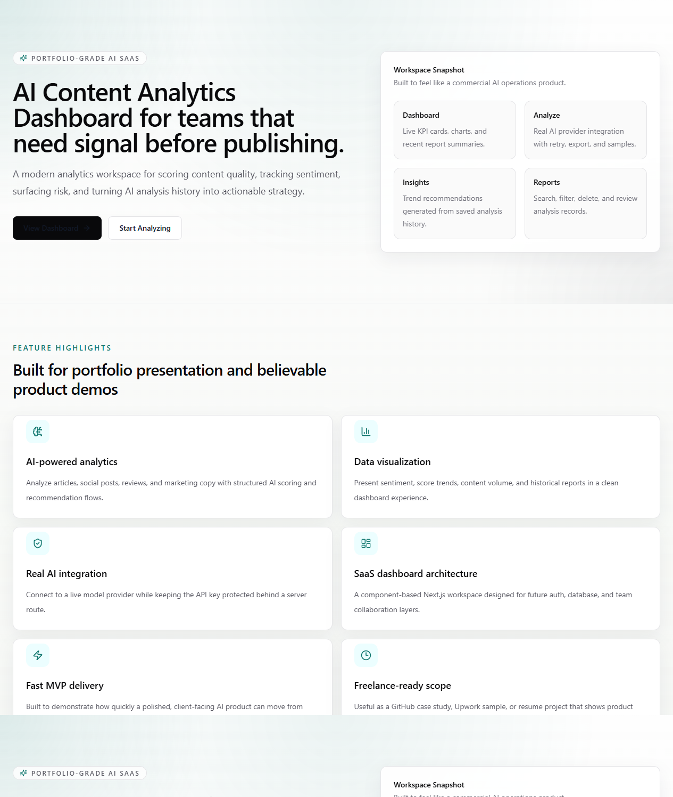
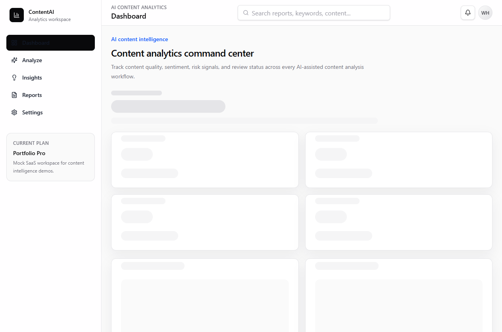
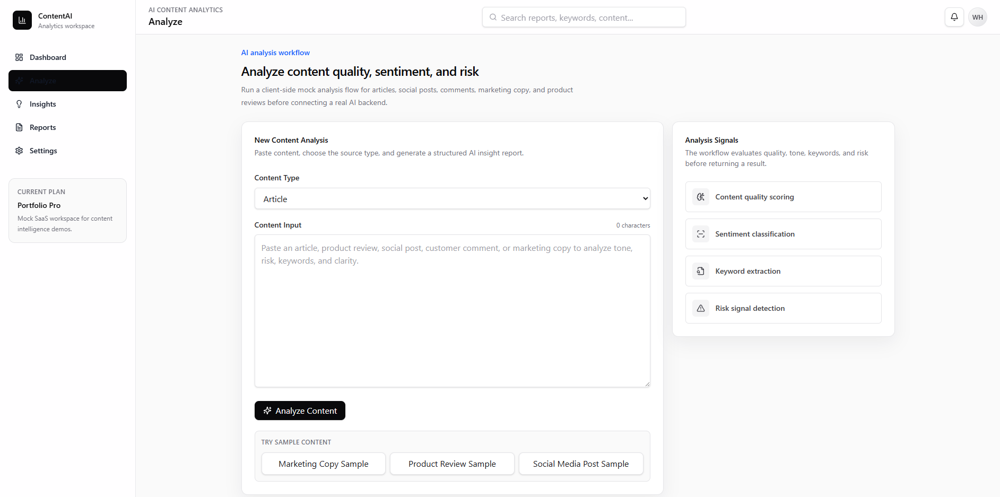
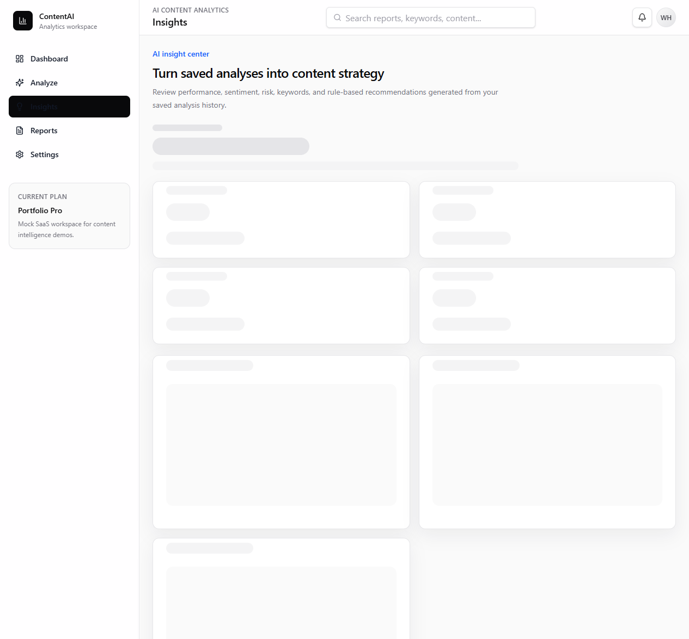
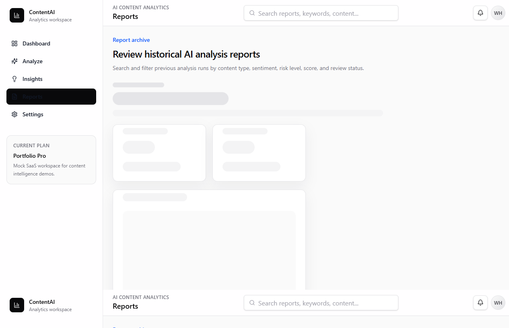

# AI Content Analytics Dashboard

AI Content Analytics Dashboard is a modern AI SaaS dashboard for analyzing content performance, sentiment, keywords, risk level, and AI-generated recommendations.

The project is built as a professional freelance portfolio piece for GitHub, Upwork, and resume use. It demonstrates a polished SaaS product interface, responsive dashboard layouts, real server-side AI analysis, saved browser history, report management, and component-based frontend architecture.

## Live Demo

Live demo: [https://ai-content-analytics-dashboard.vercel.app](https://ai-content-analytics-dashboard.vercel.app)

GitHub: [https://github.com/wh8344/ai-content-analytics-dashboard](https://github.com/wh8344/ai-content-analytics-dashboard)

## Screenshots











## Key Features

- AI analytics dashboard with KPI cards and visual analytics
- Real AI content analysis workflow through a server-side provider route
- Switchable provider architecture for OpenAI and MiniMax configuration
- Saved analysis history using browser localStorage
- Sentiment and risk visualization using charts and badges
- Reports table with search, filters, clickable detail pages, delete, and clear-all actions
- AI insights page with trend summaries, keyword analysis, risk alerts, and rule-based recommendations
- JSON and CSV export options for analysis reports
- SaaS settings page with profile, AI model, notifications, theme, and billing plan sections
- Responsive modern UI for desktop, tablet, and mobile layouts

## Tech Stack

- Next.js
- React
- TypeScript
- Tailwind CSS
- shadcn/ui-style components
- Recharts
- Lucide React
- Vercel

## Project Structure

```text
app/
  api/analyze/
  dashboard/
  analyze/
  insights/
  reports/
  settings/
components/
  analyze/
  dashboard/
  insights/
  reports/
  ui/
src/
  data/
  lib/
  types/
lib/
portfolio/
screenshots/
```

## Environment Variables

Create a `.env.local` file in the project root:

```bash
AI_PROVIDER=openai

OPENAI_API_KEY=your_openai_api_key_here
OPENAI_API_BASE_URL=https://api.openai.com/v1
OPENAI_MODEL=gpt-4o-mini

MINIMAX_API_KEY=your_minimax_token_plan_key_here
MINIMAX_API_BASE_URL=https://api.minimaxi.com/v1
MINIMAX_MODEL=MiniMax-M2.7
```

Set `AI_PROVIDER` to `openai` or `minimax`. API keys are used only inside the server API route and are never exposed to the browser.

API key locations:

- OpenAI: `https://platform.openai.com/api-keys`
- MiniMax: `https://platform.minimaxi.com`
- Anthropic Claude: `https://console.anthropic.com/settings/keys`
- Google Gemini: `https://aistudio.google.com/app/apikey`

## How to Run Locally

Install dependencies:

```bash
npm install
```

Start the development server:

```bash
npm run dev
```

Open the app:

```text
http://localhost:3000
```

Use the AI analysis feature:

1. Open `/analyze`.
2. Paste content with at least 20 characters or choose a sample.
3. Select a content type.
4. Click `Analyze Content`.
5. The app calls `/api/analyze`, which sends the request to the configured server-side provider and returns structured analysis JSON.
6. Successful results are saved to browser localStorage and appear in `/reports`, `/dashboard`, and `/insights`.
7. Click `View` in `/reports` to open a report detail page and export JSON or CSV.

Build for production:

```bash
npm run build
```

## Portfolio Value

This project demonstrates:

- React dashboard development
- Data visualization with Recharts
- AI SaaS product UI design
- Component-based architecture
- Server-side AI provider integration
- Client-side analysis history and report detail workflows
- Responsive SaaS application layout
- Fast MVP delivery ability
- Clean frontend structure using TypeScript and reusable components

It is suitable for showcasing frontend engineering skills for AI SaaS products, analytics dashboards, admin panels, and business-facing web applications.

## Current Scope

The app includes a real server-side AI analysis route, dynamic localStorage-powered dashboard metrics, reports, report detail pages, and insights. It does not include database persistence, authentication, payment processing, team accounts, or server-side report storage yet.

## Future Improvements

- Real authentication
- Database persistence
- Export reports as PDF
- Team workspace
- Multi-language support
- Production analytics and usage limits
